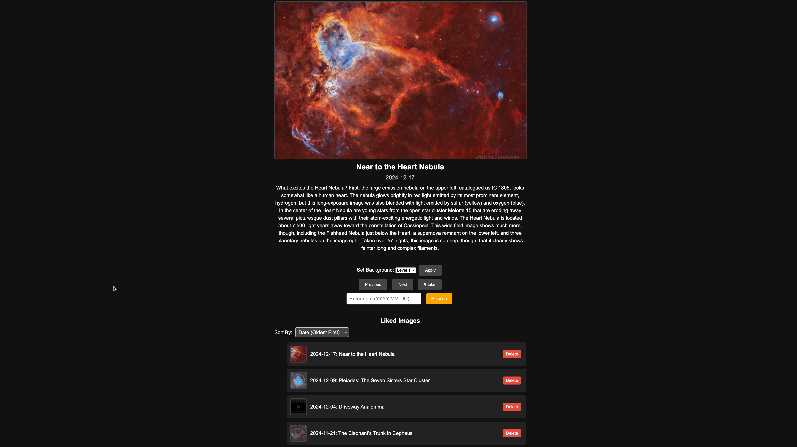
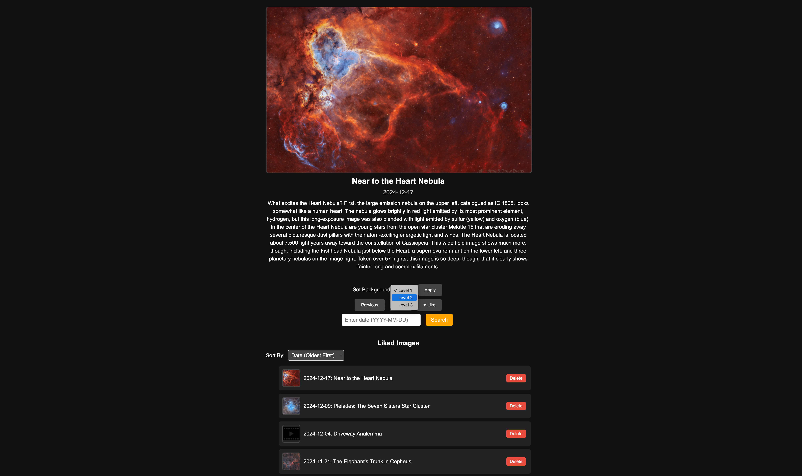
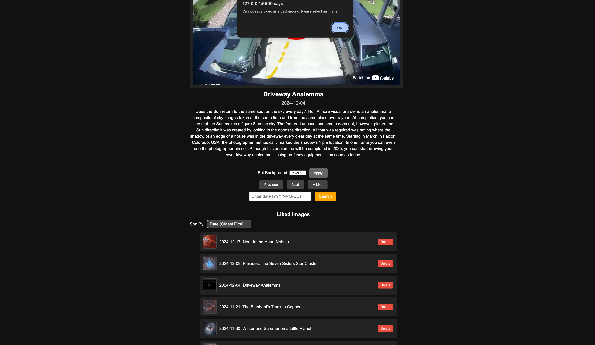

# NASA APOD Image Gallery and Defender Game Integration

## Introduction

This project is a front-end application that fetches NASA’s Astronomy Picture of the Day (APOD) and presents it in a user-friendly gallery format. Originally inspired by the need to find suitable background images for a space game called *Defender*, this tool makes browsing APOD images easier, more enjoyable, and directly useful for customizing the game’s aesthetics.

---

## Background (Context)

In the Defender game, each level has a space-themed background. Sourcing these backgrounds from NASA’s APOD website proved cumbersome: each image required manually clicking through a calendar-like interface, making it hard to quickly find the perfect images. This project streamlines that process by:

- Letting users easily browse through APOD images by date.
- Allowing users to “like” and save interesting images to a favorites list.
- Providing a seamless way to apply a chosen image as a Defender game level background.

By turning a previously tedious search into a fun and interactive gallery, it enhances both the game’s quality and the user experience.

---

## Features

- **Browse by Date:**  
  Navigate through APOD images using previous/next buttons or arrow keys. Jump directly to a specific date to find a particular APOD quickly.

- **Image and Video Support:**  
  APOD includes both images and videos. Images can be viewed and applied to the Defender game. Videos can be watched but not applied as backgrounds.

- **Liking and Favorites List:**  
  “Like” an image or video to add it to your favorites list for easy retrieval. Liked items persist across sessions via local storage.

- **Integration with Defender Game:**  
  Select a favorite image and apply it to a chosen Defender game level directly from the gallery. When you load the Defender game afterward, your selected background will be ready.

- **Local Storage Persistence:**  
  Your liked images and chosen backgrounds are stored in local storage, ensuring they remain available even after closing the browser.

---

## Getting Started

1. **Open the `index.html` File:**  
   No installation or server setup is required. Simply open `index.html` in your web browser (Chrome, Firefox, Safari, or Edge).

2. **Embedded NASA API Key:**  
   A NASA API key is already embedded in the code for convenience during grading. While this isn’t a best practice in a production environment, it’s acceptable here for demonstration.

3. **No Additional Dependencies:**  
   The project uses only HTML, CSS, and JavaScript—no external build tools or package managers needed.

---

## Navigation and Controls

- **Date Navigation:**  
  Use the “Previous” and “Next” buttons or your keyboard’s arrow keys to move through the APOD gallery day-by-day.  
  Enter a date in `YYYY-MM-DD` format and click “Search” (or press Enter) to jump directly to that day’s APOD.

- **Liking and Favorites:**  
  Click the “Like” button on an APOD image or video to add it to your favorites list. Access your favorites at any time to revisit previously liked content.

- **Applying to Defender Game Levels:**  
  Choose a Defender game level from the dropdown menu, then click the “Apply” button to set the currently viewed APOD image as that level’s background.

- **Videos Not Applicable as Backgrounds:**  
  If you attempt to apply a video as a background, an error message will explain that only images are supported.

---

## Integration with the Defender Game

After choosing and applying an APOD image to a game level, simply load or refresh the Defender game. The selected image will replace the default background for that level, making the experience more personalized and visually appealing. No additional steps are required; the integration is handled entirely on the client side.

---

## Data Handling and Technical Highlights

This project demonstrates several key front-end development techniques:

- **DOM Manipulation & Traversal:**  
  - *api.js*: Dynamically creates an iframe for APOD videos and inserts it into the DOM.  
  - *eventHandlers.js*: Builds and updates a list of liked images by creating and appending DOM elements (li, img, button).  
  - *ui.js*: Shows/hides elements, updates text content, and removes DOM nodes to reflect different states (loading, no image found, etc.).

- **Event Handling:**  
  - *eventHandlers.js*: Captures user interactions through `click` (like, delete, apply background), `change` (sorting), and `keydown` (arrow keys for navigation, Enter for searching) events.  
  - *main.js*: Uses `window.onload` to initialize the application when the page finishes loading.

- **Data Structures & Storage:**  
  - *storage.js*: Manages persistent data with `localStorage`, storing and retrieving arrays and objects (liked images, backgrounds).  
  - *eventHandlers.js*: Sorts and filters arrays of liked images to improve the user experience.  
  - *api.js*: Handles JSON data from the NASA APOD API response.

- **Form Validation:**  
  - *eventHandlers.js*: Validates the user’s date input format before performing a search, ensuring smoother user interactions and avoiding invalid requests.

- **AJAX (Fetch API):**  
  - *api.js*: Uses `fetch()` to asynchronously retrieve APOD data from the NASA API, updating the UI upon successful response.

---

## Potential Use of Closures

While the current code structure is functional and modular, there’s room for further architectural improvement. For example, in *storage.js*, variables like `currentDate` and `likedImages` are stored as top-level variables. One future enhancement could involve using **closures** to encapsulate these variables, making them private and accessible only through defined getter/setter functions. This would:

- Enhance data integrity by preventing accidental external modifications.
- Make the code more maintainable and secure.

This is purely an optional future improvement; the current setup is perfectly acceptable for this project’s scope.

---

## Screenshots

1. **Main Gallery View:**  
   

2. **Applying an APOD to a Defender Level:**  
   

3. **Error Handling Example:**  
   

*(Replace placeholder text with actual image files or remove if not applicable.)*

---

## Future Improvements

- **Enhanced Filtering:**  
  Add filters by media type, date ranges, or keywords to help users find specific APODs more quickly.

- **Offline Mode:**  
  Implement a service worker to cache images for offline browsing.

- **Additional Customization:**  
  Allow adjusting brightness or overlays on the chosen backgrounds before applying them to the Defender game.

- **State Encapsulation with Closures:**  
  Consider using closures to encapsulate and protect internal state variables in *storage.js*, improving data integrity and maintainability.

---

## Conclusion

This NASA APOD gallery simplifies the process of finding, enjoying, and selecting images from NASA’s APOD service. By integrating seamlessly with the Defender game, it turns a once time-consuming task into a smooth, engaging, and creative experience. With opportunities for future enhancements like closures-based state encapsulation, the project also offers lessons in writing more secure and maintainable code.

Enjoy exploring the cosmos and customizing your Defender game!
