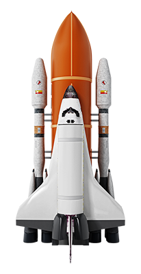
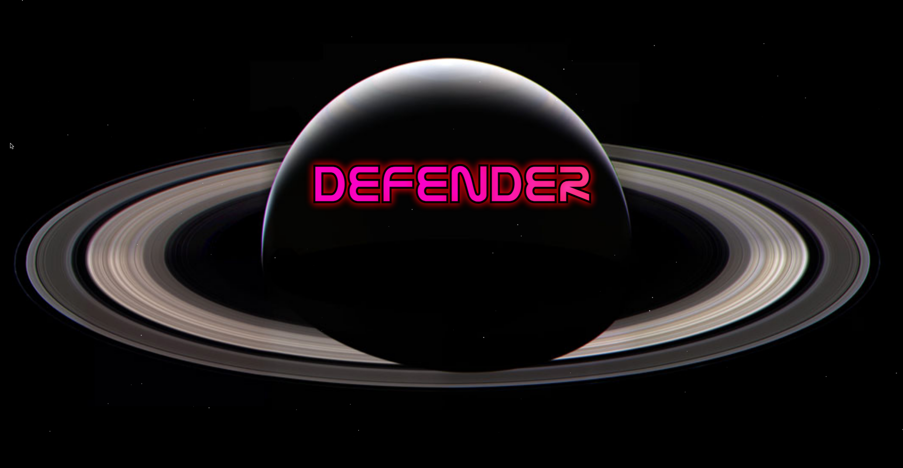
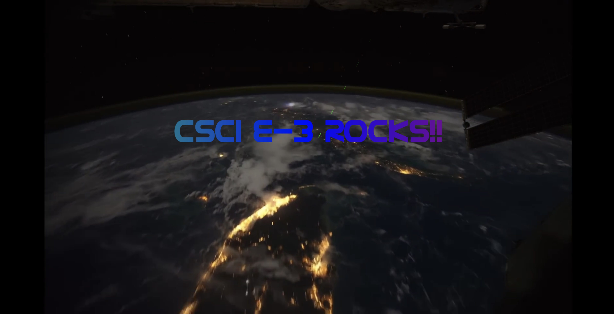

# Defender Space Game

## Introduction

The Defender Space Game is an action-packed, arcade-style shooter set in outer space. Players pilot a spaceship through multiple levels, fending off waves of enemies, dodging obstacles, and striving for high scores. Originally developed as a standalone experience, the integration with the NASA APOD image gallery has now brought dynamic, customizable backgrounds to each level, enhancing the game's visual appeal and replay value.

---

## Background (Context)

The Defender game was created to challenge players with fast-paced, skill-based combat in a vibrant interstellar environment. While the core gameplay worked well, the static backgrounds felt repetitive. By integrating with the NASA APOD gallery, players can now personalize each gameplay session by choosing unique cosmic imagery as their level backdrops—making each run feel fresh and immersive.

Key motivations for this enhancement include:

- Adding visual variety and aesthetic depth to the gameplay.
- Encouraging players to explore NASA’s astronomical imagery.
- Seamlessly blending educational content (astronomy) with pure entertainment.

---

## Features

- **Multiple Levels & Difficulty Scaling:**  
  Progress through three increasingly challenging levels:
  1. **Level 1:** Slow, rotating asteroids requiring multiple hits to destroy.
  2. **Level 2:** Faster-falling asteroids plus satellites for extra challenge.
  3. **Level 3 (Boss Level):** A formidable boss asteroid with a health bar, plus a NASA rocket health bar for the player.

- **Arcade-Style Combat & Controls:**  
  - Move your spaceship with arrow keys or `j`, `k`, `l`, `i`.
  - Shoot lasers using the spacebar.
  - After winning, celebrate on the victory screen by firing lasers again for a fun effect.

- **Dynamic Difficulty & Feedback:**  
  Each level introduces new mechanics:
  - Levels 1 & 2 rely on a life-based system with three extra lives.
  - Level 3 uses a health bar system instead of extra lives.
  - Visual and audio feedback (flashing objects, alarm sounds, explosions) inform the player of hits and damage taken.

- **Custom Backgrounds from NASA APOD:**  
  Personalize each level's background by selecting images in the NASA APOD gallery companion app. The Defender game reads these selections and displays them as level backdrops.

- **Score & Persistence:**  
  Although traditional score tracking is minimal, the primary goal is survival and defeating enemies. Locally stored backgrounds ensure that each subsequent play session can maintain user-selected imagery.

---

## Getting Started

1. **Open the `index.html` File:**  
   No special setup required. Simply open `index.html` in a modern web browser (Chrome, Firefox, Safari, or Edge).

2. **No Additional Dependencies:**  
   The Defender game runs on vanilla HTML, CSS, and JavaScript. No extra build tools or packages are needed.

3. **Optional NASA APOD Integration:**  
   If you have the NASA APOD gallery integrated alongside this game, any backgrounds you set there will appear here. Otherwise, the game defaults to its original backgrounds.

---

## Navigation and Controls

- **Movement:**  
  Use arrow keys or `j`, `k`, `l`, `i` to move your spaceship around the screen.  
  The game’s collision detection ensures you can’t move beyond the screen or behind UI elements.

- **Firing Lasers:**  
  Press the spacebar to shoot lasers. In the boss level (Level 3), you can damage the boss directly and indirectly by destroying asteroids and satellites.

- **Level Progression:**  
  - **Level 1:** Destroy a certain number of asteroids to progress.
  - **Level 2:** Similar, but now includes satellites.
  - **Level 3:** Face the boss asteroid with a health bar. Survive and deplete its health to win.

- **Victory Celebration:**  
  After defeating the boss, enjoy the victory screen and use the arrow keys and spacebar to fire lasers in celebration.

---

## Integration with the NASA APOD Gallery

When the NASA APOD gallery is available:

- **Applying Backgrounds:**  
  After selecting and applying an APOD image to a particular level in the gallery, simply load or refresh the Defender game. The chosen APOD image will replace the default background for that level.

- **Persistent Customization:**  
  The NASA APOD gallery stores user-selected backgrounds in local storage. The Defender game reads these values, ensuring each session can start with your chosen cosmic imagery already in place.

---

## Data Handling and Technical Highlights

This project showcases several front-end development concepts:

- **DOM & Canvas Rendering:**  
  - Uses the HTML `<canvas>` element extensively for gameplay: drawing sprites, asteroids, satellites, the boss, and UI elements (health bars, counters).
  - Dynamically creates and appends a `<video>` element to the DOM for the victory screen background.

- **Event Handling:**  
  - Captures `keydown` and `keyup` events for player movement, firing weapons, and navigating menus.
  - Handles `window.onload` and `resize` events, ensuring the game adapts to the browser window size and that assets load correctly before starting.

- **Data Structures & State Management:**  
  - Stores and updates arrays of asteroids, lasers, stars, and boss projectiles throughout the game loop.
  - Uses objects to define levels (number of asteroids, background images, music) and maintains various game states (current level, lives, rocket health).
  - Integrates with `localStorage` to persist background choices selected from the NASA APOD gallery.

- **AJAX (Fetch API):**  
  - Fetches images from the NASA APOD API using `fetch()`, allowing dynamic level backgrounds to be set based on user preferences.
  - Ensures a more personalized and educational gaming experience by showing real astronomical images.

- **Potential Use of Closures (Future Enhancement):**  
  While not implemented currently, closures could encapsulate internal game state (e.g., arrays of asteroids or the player’s health) within private scopes. This would:
  - Enhance data integrity by preventing unintended external modifications.
  - Make the code more modular and maintainable as the game grows in complexity.

---

## Screenshots

1. **Title Screen View:**  
   

2. **Gameplay in Action:**  
   

3. **Boss Level & Health Bars:**  
   

4. **Victory Screen:**  
   

---

## Future Improvements

- **More Enemy Variety & Boss Fights:**  
  Introduce unique enemy types with special abilities and epic boss battles for increased challenge.

- **Enhanced Animations & Particle Effects:**  
  Add richer visual effects for explosions, power-ups, and environmental details to further immerse players.

- **Online Leaderboards:**  
  Allow players to submit their scores online and compete globally.

- **State Encapsulation with Closures:**  
  Adopt closures to control and protect internal game variables, improving the code’s maintainability and scalability.

---

## Conclusion

The Defender Space Game provides a classic arcade shooter experience infused with modern flexibility. With integration to the NASA APOD gallery, players can tailor their interstellar playground with stunning, real-world astronomical imagery—bridging the gap between pure entertainment and a subtle educational element. As the project evolves, enhancements like closures, more varied enemies, and online features can further enrich this cosmic experience.

Enjoy defending the cosmos and discovering new vistas among the stars!
